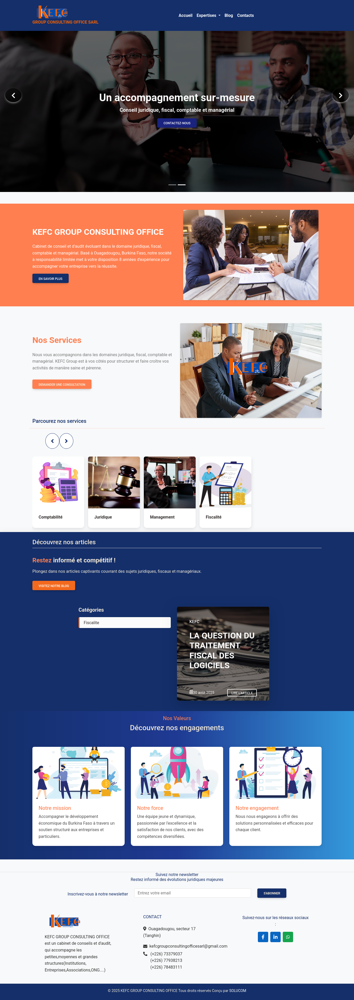
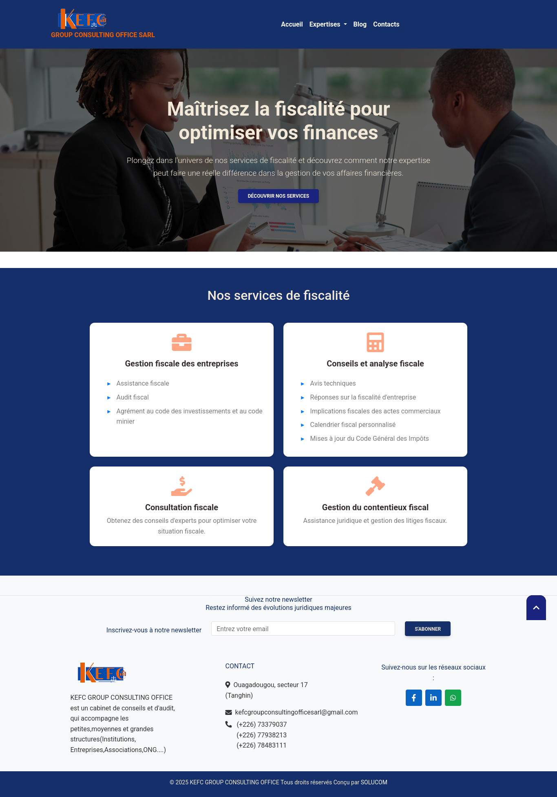
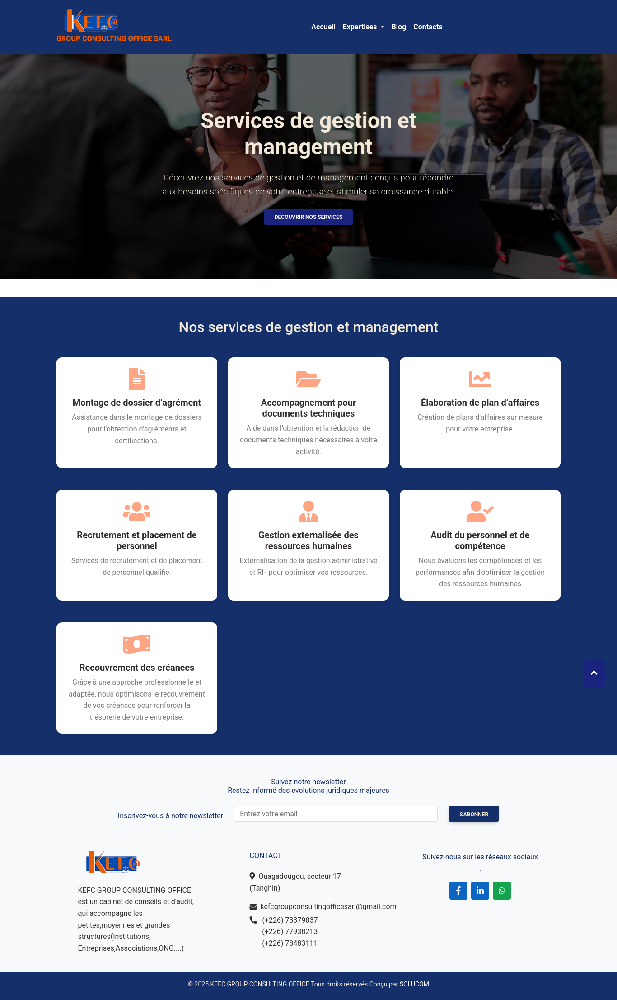
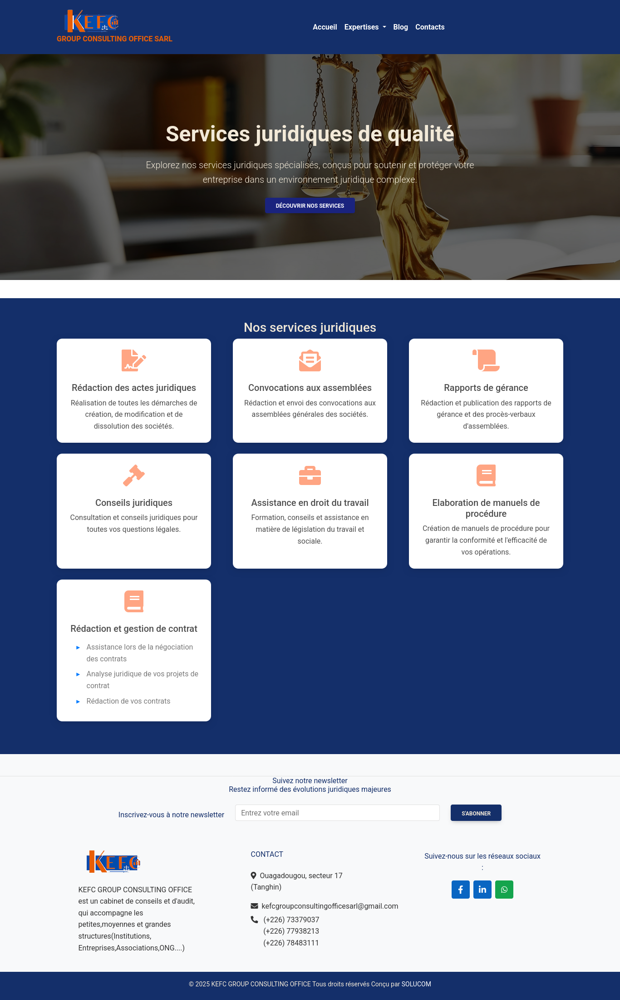
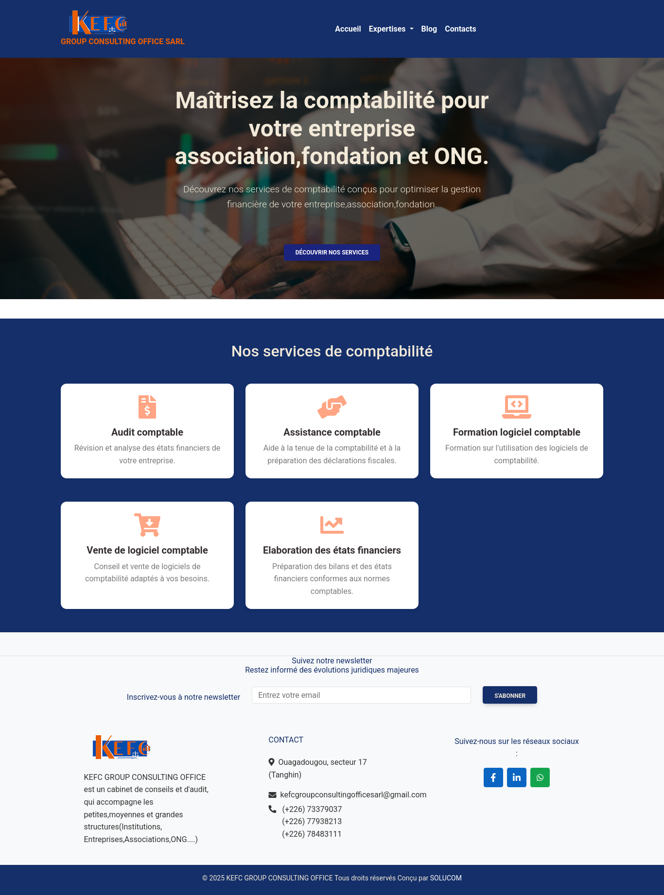
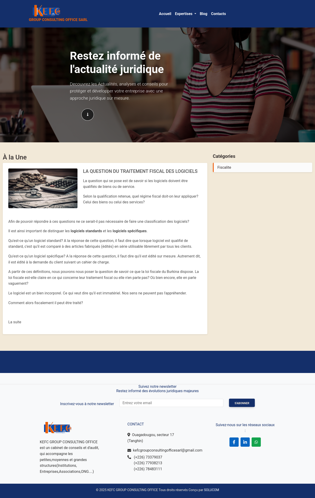
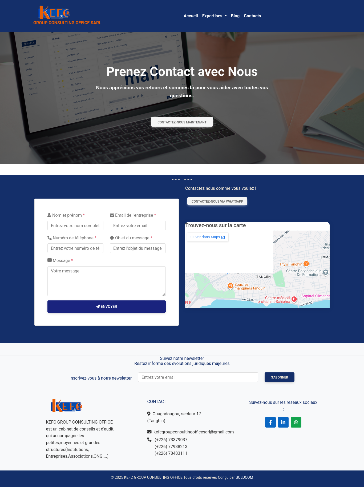

# KEFC GROUP CONSULTING OFFICE SARL — Site institutionnel & plateforme digitale

## 📌 Présentation

**KEFC GROUP CONSULTING OFFICE SARL** est une plateforme web institutionnelle développée pour présenter les activités,expertises et services d'un cabinet de conseil.
Le site permet de renforcer la présence digitale du cabinet,de présenter ses différents domaines d'expertise et de faciliter la prise de contact avec les clients et prospects.
La solution a été développée avec **Django** et pensée pour offrir une interface professionnelle,responsive et facilement administrable.

---

## 🎯 Objectifs du projet

Le projet avait pour objectifs de:
* créer une présence digitale professionnelle pour le cabinet;
* présenter clairement les domaines d'expertise;
* faciliter l'accès aux informations sur les services;
* permettre aux visiteurs de contacter facilement le cabinet;
* publier des contenus à travers un espace blog;
* proposer une interface adaptée aux ordinateurs,tablettes et smartphones;
* mettre en place une architecture permettant la gestion dynamique des contenus.

---

## 🏢 Domaines d'expertise

Le site présente plusieurs domaines d'intervention du cabinet:

### 📊 Fiscalité
Présentation des services et expertises liés à la fiscalité et à l'accompagnement des entreprises.

### 📈 Management
Présentation des services d'accompagnement et de conseil en management.

### ⚖️ Juridique
Présentation des prestations liées à l'accompagnement et au conseil juridique.

### 🧾 Comptabilité
Présentation des services et solutions liés à la comptabilité et à l'accompagnement financier.

---

## ⚙️ Fonctionnalités principales

### 🌐 Interface publique

* Page d'accueil
* Présentation du cabinet
* Présentation des expertises
* Pages de services
* Blog / actualités
* Page contact
* Formulaire de contact
* Navigation responsive

### 📝 Gestion des contenus

L'utilisation de Django permet de gérer dynamiquement les contenus du site et de faciliter leur mise à jour.
L'intégration de **CKEditor** permet notamment de gérer la rédaction et la mise en forme de contenus éditoriaux.

### 👤 Gestion des comptes

Le projet comprend également une application dédiée à la gestion des comptes utilisateurs.

---

## 🎨 Interface & expérience utilisateur

L'interface a été conçue pour proposer une expérience:
* professionnelle;
* claire;
* responsive;
* intuitive;
* adaptée aux différents supports.
Une attention particulière a été portée à la hiérarchisation des informations et à la présentation des expertises du cabinet.

---

## 🔎 Présence digitale

Le site constitue une vitrine digitale permettant au cabinet de:
* présenter son identité;
* valoriser ses expertises;
* communiquer sur ses services;
* publier des contenus;
* faciliter la prise de contact avec ses prospects et clients.

---

## 🗄️ Backend & données

Le backend a été développé avec **Django**.
L'architecture du projet est organisée notamment autour des applications:

* `cabinet`
* `compte`
Le projet utilise une base de données relationnelle **PostgreSQL**.
La gestion des données et des contenus permet de rendre plusieurs éléments du site dynamiques et administrables.

---

## 🖥️ Technologies utilisées

| Domaine            | Technologies                |
| ------------------ | --------------------------- |
| Backend            | Python, Django              |
| Framework          | Django 4.2                  |
| Frontend           | HTML5,CSS3,JavaScript     |
| Base de données    | PostgreSQL                  |
| Éditeur de contenu | Django CKEditor 5           |
| Formulaires        | Django Forms,Widget Tweaks |
| Téléphone          | Python Phonenumbers         |
| Images             | Pillow                      |
| Configuration      | Python Decouple             |
| Versioning         | Git                         |
| Serveur            | Linux / VPS                 |
| Serveur Web        | Nginx                       |
| Application Server | Gunicorn                    |
| Sécurité           | SSL / HTTPS                 |

---

## 📸 Aperçu

### 🏠 Accueil

### 📊 Expertise — Fiscalité

### 📈 Expertise — Management

### ⚖️ Expertise — Juridique

### 🧾 Expertise — Comptabilité

### 📰 Blog

### 📞 Contact

---

## 🖥️ Déploiement & infrastructure

La solution a été déployée sur un environnement serveur Linux avec une architecture adaptée à une application Django en production.
L'infrastructure comprend notamment:
* **Linux**
* **Nginx**
* **Gunicorn**
* **PostgreSQL**
* **SSL / HTTPS**
* **Git**
Cette architecture permet de séparer le serveur web,l'application Django et la base de données tout en assurant une meilleure stabilité de la solution.

---

## 🔐 Sécurité

La mise en production prend en compte plusieurs aspects de sécurité:
* utilisation du protocole HTTPS;
* configuration du serveur web;
* séparation des paramètres sensibles de l'application;
* utilisation de variables d'environnement;
* protection des accès à l'administration;
* gestion sécurisée de la base de données.

---

## 👨‍💻 Rôle dans le projet

**Développement Web & Déploiement**

Interventions sur plusieurs étapes du projet:
* conception et développement du site web;
* développement backend avec Django;
* intégration de l'interface frontend;
* conception des fonctionnalités dynamiques;
* développement des pages d'expertise;
* mise en place du blog;
* développement du formulaire de contact;
* gestion des comptes utilisateurs;
* intégration de l'éditeur de contenu;
* conception et gestion de la base de données PostgreSQL;
* configuration de l'environnement de production;
* déploiement sur serveur Linux;
* configuration Nginx / Gunicorn;
* sécurisation avec SSL;
* gestion du versioning avec Git.

---

## 📂 Confidentialité du code source

Ce repository présente cette réalisation dans le cadre d'un **portfolio professionnel**.
Les éléments propriétaires,données sensibles et informations confidentielles liés au cabinet ne sont pas destinés à être exposés publiquement.
Les captures d'écran permettent de présenter l'interface et les principales fonctionnalités de la solution sans divulguer les informations confidentielles du projet.

---

## 🌐 Projet

**Site institutionnel:** KEFC GROUP CONSULTING OFFICE SARL
**Lien du site:** [https://kefcgroupconsultingoffice.com/]
